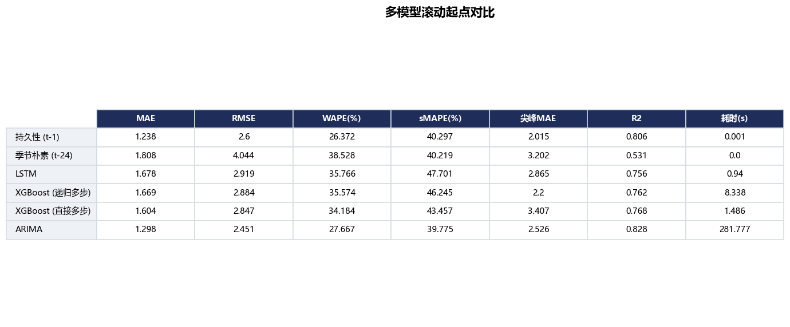
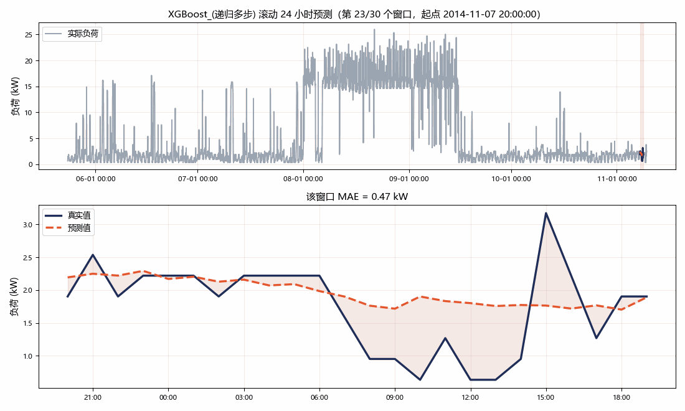

# ⚡ 电力负荷短期预测与异常检测

基于 UCI `ElectricityLoadDiagrams20112014` 的**短期负荷预测**（未来 24 小时）与**用电异常检测**，
包含 6 个模型（持久性 / 季节朴素两条基线 + LSTM + XGBoost 的递归与直接两种多步策略 + ARIMA）
在统一滚动起点上的对比、日期与温度特征消融、3σ 与 Isolation Forest 的检测器对比，
以及一个可直接上传数据的 Streamlit 界面。

代码按数据、特征、模型、评估、绘图分层组织，换数据源或加模型都只动对应的那一层；
仓库里另外保留了一份单文件版 `时序预测LSTM.py`，把整条流程写在一个脚本里，方便快速通读。

## 交付内容一览

| 计划项 | 实现 | 产物 |
| --- | --- | --- |
| **加对比模型** | LSTM、XGBoost（递归多步 / 直接多步两种策略）、ARIMA/SARIMA（每个起点用末尾窗口重拟合），外加持久性与季节性朴素两条基线，全部在同一批滚动起点上预测同样的窗口 | `results/model_comparison.csv`、`results/figures/01_model_comparison.png` |
| **加特征工程** | 日期特征（小时/星期/月份/周末/节假日 + sin-cos 周期编码）与温度特征（当前温度、昨日同时刻温度、24h 均温、HDD18、CDD22），做逐级消融 | `results/ablation_features.csv`、`results/figures/08_feature_ablation.png` |
| **升级异常检测** | Isolation Forest（9 维特征，仅在训练段拟合）替换全局 3σ，并保留滚动 3σ 作中间档；用注入异常做量化对比 | `results/anomaly_benchmark.csv`、`results/figures/11_anomaly_benchmark.png` |
| **Streamlit 界面** | Plotly 交互图 + CSV/TXT 上传 + 参数面板 + 结果下载 | `app.py`、`results/figures/forecast_roll.gif` |
| **整理 GitHub** | 本 README、requirements、模块化目录、单元测试、结果表格与图表 | 本文件、`tests/`、`results/figures/` |
| **AI 能力** | AI 分析日报、智能问答、异常自动归因三件套，走 Function Calling 而不是 RAG | `src/llm/`、`scripts/ai_report.py`、`results/daily_report_example.md` |

## 结果速览





<p align="center"><i>滚动 24 小时预测动画：左侧高亮当前预测窗口，右侧是该窗口的预测 vs 真实</i></p>


## 实验结果

<!-- BEGIN:RESULTS -->

> 数据：`LD2011_2014.txt` 第 1 列客户（MT_001），26305 小时（2012-01-01 00:00 ~ 2015-01-01 00:00）；滚动起点 30 个 × 每窗口 24 步。

### 1. 多模型对比（池化指标：把 30 个预测窗口的点拼起来算一次）

| 模型 | MAE | RMSE | WAPE(%) | MAPE(%) | sMAPE(%) | 尖峰MAE | R2 | 窗口数 | 耗时(s) |
| --- | --- | --- | --- | --- | --- | --- | --- | --- | --- |
| **持久性 (t-1)** | 1.238 | 2.600 | 26.372 | 69.543 | 40.297 | 2.015 | 0.806 | 30.000 | 0.001 |
| **ARIMA** | 1.298 | 2.451 | 27.667 | 65.534 | 39.775 | 2.526 | 0.828 | 30.000 | 281.777 |
| **XGBoost (直接多步)** | 1.604 | 2.847 | 34.184 | 93.322 | 43.457 | 3.407 | 0.768 | 30.000 | 1.486 |
| **XGBoost (递归多步)** | 1.669 | 2.885 | 35.574 | 114.845 | 46.245 | 2.200 | 0.761 | 30.000 | 8.338 |
| **LSTM** | 1.678 | 2.919 | 35.766 | 110.602 | 47.701 | 2.865 | 0.756 | 30.000 | 0.940 |
| **季节朴素 (t-24)** | 1.808 | 4.045 | 38.528 | 77.953 | 40.219 | 3.202 | 0.531 | 30.000 | 0.000 |

### 2. 特征工程消融（XGBoost）

| 模型 | MAE | RMSE | WAPE(%) | 尖峰MAE | R2 | MAE相对提升(%) | 累计提升(%) |
| --- | --- | --- | --- | --- | --- | --- | --- |
| **Lags only** | 1.78 | 3.13 | 38.00 | 2.47 | 0.72 | 0.00 | 0.00 |
| **+ Calendar** | 1.73 | 3.04 | 36.93 | 2.30 | 0.73 | 2.81 | 2.81 |
| **+ Calendar + Temperature** | 1.67 | 2.88 | 35.57 | 2.20 | 0.76 | 3.67 | 6.37 |

### 3. 异常检测器对比（注入已知异常）

| 检测器 | ROC_AUC | PR_AUC | F1@5% | 默认阈值_Precision | 默认阈值_Recall | 默认阈值_F1 |
| --- | --- | --- | --- | --- | --- | --- |
| **3-sigma (global)** | 0.551 | 0.169 | 0.084 | 0.952 | 0.035 | 0.068 |
| **3-sigma (rolling 24h)** | 0.707 | 0.426 | 0.406 | 0.753 | 0.203 | 0.320 |
| **Isolation Forest** | 0.704 | 0.402 | 0.346 | 0.740 | 0.225 | 0.344 |

事件级召回率（默认阈值）：

| 检测器 | 尖峰(全局极端) | 骤降(全局极端) | 平台(连续) | 上下文(局部异常) |
| --- | --- | --- | --- | --- |
| **3-sigma (global)** | 0.18 | 0.00 | 0.00 | 0.00 |
| **3-sigma (rolling 24h)** | 0.38 | 0.05 | 0.00 | 0.63 |
| **Isolation Forest** | 0.21 | 0.01 | 0.00 | 0.95 |

完整配置见 `results/run_config.json`，原始指标见 `results/metrics_summary.json`。

<!-- END:RESULTS -->

### 复现实验

```bash
python scripts/fetch_data.py          # 校验/下载并解压数据
python run_pipeline.py --client-col 1 --origins 30      # 约 7 分钟，默认跑 6 个模型
python scripts/make_tables.py
python scripts/make_gif.py --model "XGBoost_(递归多步)" --days 10
python scripts/update_readme_results.py     # 把 results/*.csv 写回本 README
```

关于数据文件：压缩包约 **261 MB、解压后 711 MB**，UCI 服务器**不支持 `Range` 断点续传**，
下载中断时标准工具会直接报 `BadZipFile`。`scripts/fetch_data.py` 的做法是
「下到 `.part` → 校验 zip → 原子替换」，并在中断时用
`scripts/recover_truncated_zip.py` 把已收到的部分解出来（deflate 流是自同步的，
中断点之前的行都能恢复），避免一次网络抖动带来全部重来。

### 关于朴素基线：这台表计上持久性最强

对比表里放了两行朴素基线，结果是：**持久性（直接用上一小时的值）MAE 1.238 最低，
ARIMA 紧随其后（1.298），LSTM 和两个 XGBoost 都没有超过它们。** 这由 MT_001 的数据形态决定：

```
2013-06-03    2.9  1.9  1.6  1.6  1.9  1.9  1.6  1.3  2.9  2.1  1.3  1.0 ...
2013-06-04    1.6  1.9  2.2  1.9  1.6  7.9 15.5 15.2 18.7 16.5 15.5 20.6 ...
2014-09-15   16.8 16.2 16.5 16.5 16.5 16.5 16.2 16.2 15.9 14.3  6.0 14.9 ...
2014-09-15   15.2 14.9  2.5  0.3  0.3  0.6  0.3  1.6  2.5  1.9  1.9  1.6 ...
```

* 序列大部分时间是**平台**（连续十几个小时停在同一个读数），中间夹着**突跳**；
* 突跳既不是日周期也不是周周期（更像计量/设备侧的切换），**在时间上基本不可预测**；
* 任何"学会预测形状"的模型都会在这些点上把跳变平滑掉，误差反而比"什么都不做"更大。

两种标准的多步策略都列在表里，可以直接对照：

| 做法 | 结果 |
| --- | --- |
| **递归多步**：训练 1 步模型、自己喂自己 24 步 | MAE 1.669，误差会随步长累积 |
| **直接多步**：每个 horizon 单独训练，24 步全部锚定在起点真实值 | MAE 1.604，避免了误差累积，但"预测跳变"本身不可行 |
| **ARIMA (1,1,1)(1,1,1,24)**：自带差分 + 直接多步 | MAE 1.298，是所有学习型模型里最好的 |

**想把误差继续压下去，方向不是换更大的模型**：

1. 那些突跳很可能对应窃电/计量异常/设备投切，先用第 3 部分的异常检测把它们定位出来，
   再决定是剔除、修正还是单独建模；
2. 用「持久性 + 模型」的预测组合（在**验证集**上学权重），比让模型单独输出更稳；
3. 370 个客户的负荷形态差异极大，换一个规律性强的客户（`--client-col N`）再比较模型。

换句话说，这段序列上的误差上限主要由**可预测性**决定，而不是模型容量。

## 快速开始

```bash
# 1) 安装依赖（建议 Python 3.10+）
pip install -r requirements.txt

# 2) 校验/下载并解压数据（zip 约 261 MB、解压后 711 MB；UCI 服务器较慢）
python scripts/fetch_data.py

# 3) 跑完整实验：对比模型 + 特征消融 + 异常检测
python run_pipeline.py                        # 默认 MT_001，约 7 分钟

# 4) 生成 README 用截图和 GIF
python scripts/make_tables.py
python scripts/make_gif.py --model "XGBoost_(递归多步)" --days 10
python scripts/update_readme_results.py

# 5) （可选）配置大模型，启用 AI 日报与智能问答
#    把 .env.example 复制成 .env，填入自己的 API 密钥

# 6) 打开交互界面
streamlit run app.py
```

没下到数据也能先跑起来看效果：

```bash
python run_pipeline.py --synthetic --quick    # 合成数据 + 小规模，约 1 分钟
streamlit run app.py                          # 界面里选「合成演示数据」
```

## 数据说明

* **原始数据**：UCI `ElectricityLoadDiagrams20112014`，葡萄牙 370 个客户 2011-01-01 ~ 2014-12-31
  的 15 分钟用电量（kW），`;` 分隔、`,` 作小数点。
* **默认使用第 2 列客户 `MT_001`**。该客户 2011 年全年读数恒为 0（表计未接入），
  有效区间是 **2012-01-01 ~ 2014-12-31，小时级 26,305 条，无缺口**。
* **三个必须留意的数据特性**（代码里都已处理）：
  1. 很多客户（**包括 MT_001**）在 2011 年很长一段时间读数恒为 0，那是采集缺失而不是真实零负荷，
      所以先把 0 当缺失再插值（`data.zero_as_missing`）。
  2. 极端值不能"用全局均值 ±3σ 换成均值"——那会把整条曲线拉平、破坏日周期。这里的做法是
     "标记异常 + 局部插值"，并且默认用 Isolation Forest 做预处理清洗（`data.outlier_method`）。
  3. 时间轴要补成连续的小时网格，否则中间缺口会让 `lag_1` 不再是"上一小时"；
     首尾也不能用 `bfill/ffill` 外推，那等于凭空造读数。
* **数据获取**：`scripts/fetch_data.py` 负责下载、校验与解压，遇到网络中断会自动恢复已下载部分
  （见上一节的说明）。
* **温度不是这个数据集自带的**。项目默认从 [Open-Meteo 历史再分析接口](https://open-meteo.com/)
  拉取里斯本（数据集来自葡萄牙 EDP 电网）的逐小时温度作为外生变量，缓存到
  `data/cache/temperature_lisbon.csv`；无网络时自动退回合成温度并在日志里提示。

## 方法

### 统一的评估协议

**6 个模型**（2 条朴素基线 + LSTM + XGBoost×2 种多步策略 + ARIMA）在**完全相同的预测窗口**上打分，指标才可比：

* 用 `train_ratio` 按时间切出训练段和测试段（默认 8:2，**不做随机打乱**）。
* 在测试段上均匀取 `n_eval_origins` 个**滚动起点**（默认 30 个），每个起点用"已知到该时刻"
  的信息向后预测 `horizon` 步（默认 24 小时）。
* 表格用**池化指标**：把 30 个窗口 × 24 步的点拼起来算一次。逐窗口算完再平均的 WAPE/R²
  在 24 点的窗口上方差极大（一个恰好落在平台上的窗口就能把 R² 拉成很大的负数），不可比。
  逐窗口指标仍完整保留在 `results/metrics_summary.json` 里。

> **公平性说明**：预测窗口、可用历史、指标代码对 6 个模型完全一致，差别只在训练方式：
> * **朴素基线**不用训练，只取起点时刻（或昨天同时刻）的真实值；
> * **LSTM / XGBoost** 在训练段上一次性训练后用于所有起点（部署时的真实用法）；
> * **ARIMA** 在每个起点用末尾 `train_window` 小时重新拟合（ARIMA 的标准 walk-forward 用法，
>   否则参数会严重过期），表里 269 秒的耗时就是这么来的。

> **关于百分比误差**：MT_001 是台小负荷表计（均值 5.2 kW、中位数 2.2 kW；测试段有 23% 的点
> < 1 kW，最低 0.32 kW）。这种数据上 **MAPE 会被近零点放大**——单点误差就能贡献上百个百分点，
> 把整段 MAPE 拉到百分之几百。所以表格以 **WAPE（Σ|误差| / Σ|真值|）** 为主要百分比指标，
> MAPE 仅作参考（分母加了"平均负荷 10%"的下限）。

### 六个模型

| 模型 | 输入 | 多步策略 | 说明 |
| --- | --- | --- | --- |
| 持久性 (t-1) | — | 直接用起点值 | 朴素基线，整段输出 origin 时刻的真实值。**任何模型都该先打赢它** |
| 季节朴素 (t-24) | — | 昨天同时刻 | 朴素基线，第 h 步用 `y[origin+h-24]` |
| LSTM | 过去 24 小时负荷（可选外生通道） | 递归 | 目标为增量 Δy；验证集**按时间顺序**切分 + 早停，不做随机打乱 |
| XGBoost (递归多步) | 滞后/滚动 + 日期 + 温度 | 递归 | 训练 1 步模型，再自己喂自己 24 步 |
| XGBoost (直接多步) | 同上，再拼目标时刻的日历/温度 | 直接多步 | 每个 horizon 单独训练 24 个模型，全部锚定在起点真实值，没有误差累积 |
| ARIMA | 单变量（可选温度外生） | 直接多步 `forecast` | `(1,1,1)(1,1,1,24)`，可用 `--auto-arima` 走 AIC 小网格选阶 |

> **为什么预测增量 Δy 而不是绝对值**：MT_001 长时间停在同一个读数上，直接回归水平值会被
> MSE 拉向条件均值，把平台和跳变一起抹平；改成预测 `y_t - y_{t-1}`，等于让模型从"持久性"
> 出发只学修正量——ARIMA 的 `d=1` 是同一个道理。想切回绝对水平可以改
> `xgb.target_mode` / `lstm.target_mode = 'level'`。
>
> **XGBoost 的早停**：从训练段末尾切 10% 作时间序验证集（`xgb.val_ratio`），
> `early_stopping_rounds=30`。增量目标的信噪比很低，不早停会把噪声一起学进去；
> 可用 `xgb.use_early_stopping=False` 关掉。

### 特征工程

```
base         lag_1/2/3/6/12/24/48/72/168、roll_mean/std_24、roll_mean_168、diff_1、diff_24
calendar     hour、dow、month、is_weekend、is_holiday、hour/dow/month 的 sin-cos
temperature  temp、temp_lag_24、temp_roll_mean_24、hdd_18、cdd_22
```

**年度特征会自动开关**：`month` / `month_sin` / `month_cos` 只有训练段跨度 ≥ 365 天时才有意义，
否则会退化成"记住训练期那几个月"。`run_pipeline.py` 按训练跨度自动决定（日志里会打印），
也可以用 `--annual on/off` 强制。实测在一段 320 天的数据上，同一组日历特征去掉 month 项后
MAE 从 7.17 降到 6.41，所以才加了这条规则。

**训练与推理用同一套特征代码**：

* 所有滞后/滚动特征都从 `shift(1)` 起步，保证预测 t 时刻时只用 t 之前的信息
  （`tests/test_smoke.py::test_no_future_leakage` 有对应的回归测试）；
* 递归策略把预测值写回 `load` 列，再调用**同一个** `build_features`，
  所以单步特征与批量特征逐位相等（`test_next_step_row_matches_batch_features`）；
* 直接多步策略只在起点算一次特征，第 h 步额外拼上"目标时刻的日历 + 温度"，
  24 个模型互不干扰，也就不会出现递归那种误差滚雪球。

### 异常检测为什么不是简单换个模型

全局 3σ 在负荷数据上有两个硬伤：

1. 均值和标准差被早晚高峰和季节波动撑大，阈值过宽，**对局部异常几乎无感**；
2. 负荷不服从正态分布，用均值和标准差描述"正常范围"本身就不合适。

所以这里给了三级方案：

| 检测器 | 做法 |
| --- | --- |
| 3σ (global) | 最朴素的全局阈值法，作为基线保留 |
| 3σ (rolling 24h) | 用 24 小时滑动中位数和标准差，能跟上日周期 |
| Isolation Forest | 9 维特征：负荷、相对滚动中位数的偏离与比值、一阶差分、滚动波动率、局部 z 分数、小时/星期的 sin-cos；**只在训练段拟合**，避免用测试数据"见过"要检测的异常 |

评估用**注入已知异常**的方式：在真实测试序列上注入四类异常，再算检测指标。

| 注入类型 | 含义 |
| --- | --- |
| 尖峰 | ×2.5~4.0，全局极端 |
| 骤降 | ×0.15~0.40，全局极端 |
| 平台 | 连续 3~6 小时复制前一个值 |
| 上下文 | 把低负荷时段抬到"白天量级"，仍在全局正常范围内，但相对当时的小时模式明显异常 |

评价指标同时给出**与阈值无关**的 ROC-AUC / PR-AUC，和**固定报警率**（默认 5%，
即把两者的报警条数拉到同一水平）下的 Precision / Recall / F1 —— 否则 3σ 的 `k=3`
和 IF 的 `contamination` 是两套完全不同的工作点，直接比 F1 没有意义。

## AI 能力：日报 / 问答 / 自动归因

在预测与异常检测之上接了一层大模型能力。**所有数字仍由本项目的 Python 代码算出**，
模型只负责组织语言和推测可能原因——日报与回答里出现的每个数值都能在 `results/` 里找到出处。

| 功能 | 入口 | 做什么 |
| --- | --- | --- |
| **AI 分析日报** | 界面「📈 预测对比」页 → `生成分析日报`；或命令行 `python scripts/ai_report.py` | 把负荷趋势、温度条件、异常点、模型表现打包成 JSON，交给大模型写成调度员能直接读的日报 |
| **智能问答** | 界面「🤖 智能问答」页 | 自然语言提问，模型自己决定调哪些查询函数（负荷查询、异常排行、模型对比、特征重要性、画图），回答里的数字全部来自计算结果 |
| **异常自动归因** | 界面「🚨 异常检测」页 → `自动归因` | Agent 按固定顺序取证（异常点 → 同期温度 → 温度关系 → 模型误差），输出「可能原因 + 核查动作」表格 |

示例输出见 [`results/daily_report_example.md`](results/daily_report_example.md)——
里面每个数字都来自 `results/`，模型只做了归因和行文。

### 为什么不用 RAG / 向量数据库

本项目的数据是**结构化时序**（26,305 小时负荷 + 几张结果表），不是文档：
全量放进上下文也只有几十 KB，而向量检索反而可能召回错行（把 3 月的数据当成 5 月）。
所以这里走 **Function Calling** 路线：模型调用 `query_load(...)`、`find_anomalies(...)`
这类函数，由代码算出精确结果。数据量再大一个数量级也依然适用。

### 配置（三步）

1. 到 [platform.deepseek.com](https://platform.deepseek.com) 注册并创建 API Key
   （也可以换智谱 GLM / 通义千问 / Kimi，见 `.env.example`，它们都兼容 OpenAI 协议）；
2. 把根目录的 `.env.example` 复制成 `.env`，填入密钥：

   ```
   DEEPSEEK_API_KEY=sk-你的密钥
   ```

3. 重启 Streamlit 即可。`.env` 已经写进 `.gitignore`，**不会被提交到 GitHub**。

没有配置密钥时程序不会报错：日报自动降级成本地模板版，问答会提示先配置密钥。

### 成本

一次日报约 2,500 tokens，DeepSeek 折合 **0.003 元**左右；一次问答约 1,000~3,000 tokens。
日常调试十元能用很久，GLM-4-Flash 则是完全免费的选项。

### 防幻觉的三条约定

1. 提示词明确要求「只能使用给定数据里的数字，不要自己计算或推算」；
2. 数据缺失时要求写「该项数据缺失」，不允许用常识补全；
3. 异常原因只能写「可能」，并说明依据来自哪个数字。

实测效果：当异常点清单还没生成时，日报会直接写明"未提供逐点异常标记，该项数据缺失"，
而不是编一段听起来合理的分析。

## 目录结构

```
.
├── README.md
├── app.py                        # Streamlit 界面（Plotly 图 + 文件上传）
├── run_pipeline.py               # 一键跑完整实验，产出所有表格和图
├── 时序预测LSTM.py                # 单文件精简版：整条流程写在一个脚本里，便于快速通读
├── requirements.txt
├── .gitignore
├── .gitattributes
├── src/
│   ├── config.py                 # 所有参数集中在这里（dataclass）
│   ├── data.py                   # 下载/加载/重采样/清洗/温度/上传文件解析
│   ├── features.py               # 滞后、滚动、日期、温度特征
│   ├── anomaly.py                # 3σ / 滚动 3σ / Isolation Forest + 注入基准
│   ├── metrics.py                # MAE/RMSE/WAPE/MAPE/sMAPE/尖峰MAE/R²
│   ├── evaluate.py               # 滚动起点评估协议
│   ├── plots.py                  # 全部 Plotly 图（界面复用同一套）
│   ├── registry.py               # 模型保存/加载
│   ├── models/                   # naive.py / lstm.py / xgb.py / arima.py，统一接口
│   └── llm/                      # 大模型能力：client / context / tools / report / agent
├── scripts/
│   ├── fetch_data.py             # 下载 + 校验 + 解压原始数据
│   ├── recover_truncated_zip.py  # 从下载中断的 zip 里恢复已收到的数据
│   ├── make_tables.py            # 把结果表渲染成 PNG（README 用）
│   ├── make_gif.py               # 生成滚动预测 GIF
│   ├── ai_report.py              # 命令行生成 AI 日报
│   └── update_readme_results.py  # 把结果表写回 README
├── tests/
│   ├── test_smoke.py             # 无依赖测试：特征一致性、无泄漏、各模型可跑
│   └── test_llm_smoke.py         # LLM 层测试（默认离线，--live 才真实调用接口）
├── data/                         # 原始数据与缓存（已 gitignore，不会上传）
└── results/
    ├── *.csv / *.json            # 指标表与运行配置
    ├── figures/                  # 全部图表 PNG + 表格图 + GIF（README 引用这里）
    ├── pred_*.npz                # 各模型的逐窗口预测结果
    └── models/                   # 训练好的模型（已 gitignore）
```

## 常用命令

```bash
python run_pipeline.py --quick                          # 小规模冒烟测试
python run_pipeline.py --client-col 5                   # 换一个客户
python run_pipeline.py --models naive,xgb_direct,arima  # 只跑部分模型
python run_pipeline.py --annual off                     # 关掉 month 类年度特征
python run_pipeline.py --no-temperature                 # 关掉温度特征
python run_pipeline.py --auto-arima                     # ARIMA 用 AIC 选阶
python tests/test_smoke.py                              # 跑测试（10 项）
python tests/test_llm_smoke.py                          # LLM 层测试（离线）
python tests/test_llm_smoke.py --live                   # 真实调用一次大模型
python scripts/ai_report.py --out results/daily_report.md   # 命令行生成日报
python run_pipeline.py --ai-report                      # 跑完实验顺带生成日报
```

## 已知限制

* **温度是再分析数据而非原始数据集自带**，与实际表计所在位置可能有偏差；温度消融的提升幅度
  也依赖这条外部数据质量。
* **异常检测基准是"注入异常"的压力测试**，注入密度（约 10~15%）远高于真实场景的异常比例，
  因此绝对值只用于横向比较检测器，不代表生产环境的真实检出率。
* **ARIMA 每个起点都要重拟合**，在长测试段上很慢（本项目默认 30 个起点）；
  真实部署更常用的是"固定参数 + 状态空间在线更新"。
* **这台表计上朴素基线最强**（见上一节）：突跳不可预测，任何"学形状"的模型都会在跳变点
  比持久性错得更多。这是 MT_001 的特性，换成规律性强的客户结论可能反过来。
* LSTM 用递归多步，**误差随步长累积**（`results/figures/03_horizon_error.png` 能看到）；XGBoost 同时提供了
  直接多步作对照，两种策略的结果都列在表里。
* 项目只用了 `MT_001` 一个客户。要做全网负荷预测需要把 370 个客户一起建模
  （或先聚类再分层预测）。

## 后续可做

* 「持久性 + 模型」的预测组合，权重在验证集上学（目前看最有希望的方向）
* Seq2Seq / N-BEATS / TFT 与现有递归、直接多步的对比
* 概率预测（分位数损失、Conformal Prediction）替代固定宽度置信区间
* 异常检测接上告警策略：连续 N 点命中才报警，压掉单点误报
* MLflow / DVC 做实验跟踪与数据版本管理

## 参考

* 数据集：[UCI ElectricityLoadDiagrams20112014](https://archive.ics.uci.edu/dataset/321/electricityloaddiagrams20112014)
* 温度：[Open-Meteo Historical Weather API](https://open-meteo.com/en/docs/historical-weather-api)
* [Isolation Forest (Liu et al., 2008)](https://doi.org/10.1109/ICDM.2008.17)
