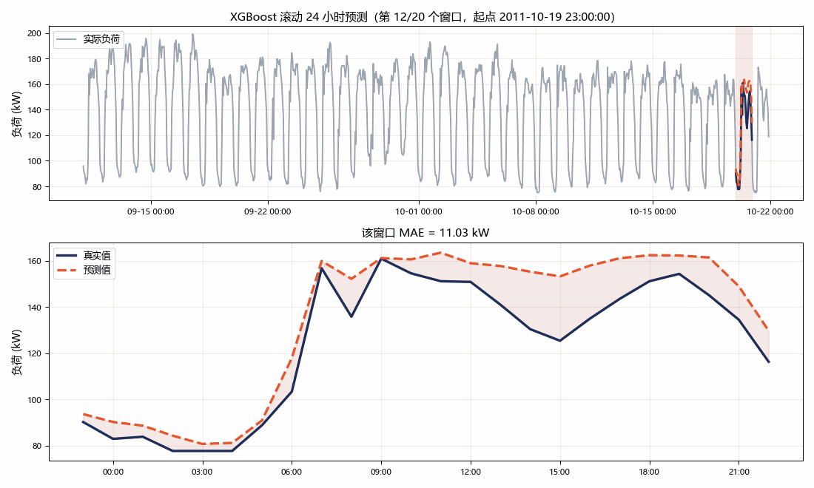
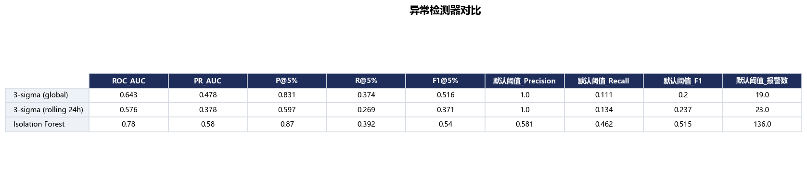

# ⚡ 电力负荷短期预测与异常检测

基于 UCI `ElectricityLoadDiagrams20112014` 的**短期负荷预测**（未来 24 小时）与**用电异常检测**，
包含 LSTM / XGBoost / ARIMA 三模型对比、日期与温度特征消融、3σ 与 Isolation Forest 的检测器对比，
以及一个可直接上传数据的 Streamlit 界面。

项目从一个单文件脚本 `时序预测LSTM.py`（原始版本，保留在仓库里作对照）重构而来：
把数据、特征、模型、评估、绘图拆成可复用模块，补齐了对比模型、特征工程、异常检测升级、
交互界面和完整实验报告。

## 交付内容一览

| 计划项 | 实现 | 产物 |
| --- | --- | --- |
| **加对比模型** | XGBoost（滞后+日期+温度特征，递归多步）与 ARIMA/SARIMA（每个起点用末尾窗口重拟合），与 LSTM 在同一批滚动起点上预测同样的窗口 | `results/model_comparison.csv`、`results/figures/01_model_comparison.png` |
| **加特征工程** | 日期特征（小时/星期/月份/周末/节假日 + sin-cos 周期编码）与温度特征（当前温度、昨日同时刻温度、24h 均温、HDD18、CDD22），做逐级消融 | `results/ablation_features.csv`、`results/figures/08_feature_ablation.png` |
| **升级异常检测** | Isolation Forest（9 维特征，仅在训练段拟合）替换全局 3σ，并保留滚动 3σ 作中间档；用注入异常做量化对比 | `results/anomaly_benchmark.csv`、`results/figures/11_anomaly_benchmark.png` |
| **Streamlit 界面** | Plotly 交互图 + CSV/TXT 上传 + 参数面板 + 结果下载 | `app.py`、`results/screenshots/forecast_roll.gif` |
| **整理 GitHub** | 本 README、requirements、模块化目录、单元测试、结果截图与 GIF | 本文件、`tests/`、`results/screenshots/` |

## 结果速览




<p align="center"><i>滚动 24 小时预测动画：左侧高亮当前预测窗口，右侧是该窗口的预测 vs 真实</i></p>



## 实验结果

<!-- BEGIN:RESULTS -->

> 数据：`partial_LD2011_2014.txt` 第 300 列客户，7679 小时（2011-01-01 00:00 ~ 2011-11-16 22:00）；滚动起点 20 个 × 每窗口 24 步。

### 1. 多模型对比（滚动起点平均）

| 模型 | MAE | RMSE | MAPE(%) | sMAPE(%) | 尖峰MAE | R2 | 窗口数 | 耗时(s) |
| --- | --- | --- | --- | --- | --- | --- | --- | --- |
| **ARIMA** | 5.805 | 7.831 | 4.400 | 4.382 | 5.902 | 0.940 | 20.000 | 165.107 |
| **XGBoost** | 6.519 | 8.479 | 4.887 | 4.830 | 6.821 | 0.932 | 20.000 | 5.482 |
| **LSTM** | 7.191 | 10.140 | 5.541 | 5.672 | 7.308 | 0.904 | 20.000 | 0.506 |

### 2. 特征工程消融（XGBoost）

| 模型 | MAE | RMSE | MAPE(%) | 尖峰MAE | R2 | MAE相对提升(%) | 累计提升(%) |
| --- | --- | --- | --- | --- | --- | --- | --- |
| **Lags only** | 7.09 | 9.27 | 5.30 | 8.25 | 0.92 | 0.00 | 0.00 |
| **+ Calendar** | 6.41 | 8.48 | 4.82 | 6.61 | 0.94 | 9.63 | 9.63 |
| **+ Calendar + Temperature** | 6.52 | 8.48 | 4.89 | 6.82 | 0.93 | -1.78 | 8.02 |

### 3. 异常检测器对比（注入已知异常）

| 检测器 | ROC_AUC | PR_AUC | F1@5% | 默认阈值_Precision | 默认阈值_Recall | 默认阈值_F1 |
| --- | --- | --- | --- | --- | --- | --- |
| **3-sigma (global)** | 0.643 | 0.478 | 0.516 | 1.000 | 0.111 | 0.200 |
| **3-sigma (rolling 24h)** | 0.576 | 0.378 | 0.371 | 1.000 | 0.135 | 0.237 |
| **Isolation Forest** | 0.779 | 0.580 | 0.540 | 0.581 | 0.462 | 0.515 |

事件级召回率（默认阈值）：

| 检测器 | 尖峰(全局极端) | 骤降(全局极端) | 平台(连续) | 上下文(局部异常) |
| --- | --- | --- | --- | --- |
| **3-sigma (global)** | 0.59 | 0.00 | 0.00 | 0.00 |
| **3-sigma (rolling 24h)** | 0.56 | 0.16 | 0.00 | 0.00 |
| **Isolation Forest** | 1.00 | 1.00 | 0.06 | 0.41 |

完整配置见 `results/run_config.json`，原始指标见 `results/metrics_summary.json`。

<!-- END:RESULTS -->

### ⚠️ 上面这份结果是用哪份数据跑的

UCI 服务器在这台机器上很不稳定：完整文件约 **169 MB**，但每次传到 ~168 MB 就被掐断
（`ChunkedEncodingError: Response ended prematurely`），而且**不支持 Range 断点续传**，
一旦断开就只能重来。所以仓库里提交的实验结果是：

* **数据**：从一次中断下载中**抢救出来的真实数据**（2011-01-01 ~ 2011-11-16，320 天 / 7,679 小时）；
* **客户**：第 300 列（很多客户含 MT_001 在 2011 年读数恒为 0，该列在这段时间有完整数据）；
* **复现命令**：

  ```bash
  python scripts/recover_truncated_zip.py data/LD2011_2014.txt.zip data/cache/partial.txt
  python run_pipeline.py --data-file data/cache/partial.txt --client-col 300 \
      --models lstm,xgb,arima --origins 20
  ```

等完整文件下载完成后，用一条命令就能复现原始脚本真正针对的 **MT_001 全量 4 年**结果：

```bash
python run_pipeline.py --client-col 1
```

顺带一提：`scripts/fetch_data.py` 现在会在下载中断时**自动抢救**已收到的部分
（deflate 流自同步，中断点之前的行都能解出来），所以即使服务器再次掐断连接，
也不会像标准工具那样直接报 `BadZipFile` 一无所有。

## 快速开始

```bash
# 1) 安装依赖（建议 Python 3.10+）
pip install -r requirements.txt

# 2) 下载并解压数据（约 140 MB，UCI 服务器较慢，约 30~60 分钟）
python scripts/fetch_data.py

# 3) 跑完整实验：对比模型 + 特征消融 + 异常检测
python run_pipeline.py

# 4) 生成 README 用截图和 GIF
python scripts/make_screenshots.py
python scripts/make_gif.py --model XGBoost --days 10
python scripts/update_readme_results.py

# 5) 打开交互界面
streamlit run app.py
```

没下到数据也能先跑起来看效果：

```bash
python run_pipeline.py --synthetic --quick    # 合成数据 + 小规模，约 1 分钟
streamlit run app.py                          # 界面里选「合成演示数据」
```

## 数据说明

* **原始数据**：UCI `ElectricityLoadDiagrams20112014`，葡萄牙 370 个客户 2011-01-01 ~ 2014-12-31
  的 15 分钟用电量（kW），`;` 分隔、`,` 作小数点。
* **默认使用第 2 列客户 `MT_001`**（与原脚本一致），小时级重采样后约 3.4 万条。
* **几个必须知道的坑**（代码里都处理了）：
  1. 很多客户（**包括 MT_001**）在 2011 年很长一段时间读数恒为 0，那是采集缺失而不是真实零负荷，
     所以先把 0 当缺失再插值（`data.zero_as_missing`）。
  2. 原脚本用"全局均值 ±3σ"替换极端值，会把整条曲线拉平、破坏日周期。现在改为
     "标记异常 + 局部插值"，并且默认用 Isolation Forest 做预处理清洗（`data.outlier_method`）。
  3. UCI 服务器不支持 `Range` 断点续传。下载中断会留下"有本地头、没有中央目录"的半个 zip，
     标准工具直接报 `BadZipFile`。`scripts/recover_truncated_zip.py` 可以从中抢救出已下载部分，
     `scripts/fetch_data.py` 会先下到 `.part`、校验通过后再原子替换，避免再次踩坑。
* **温度不是这个数据集自带的**。项目默认从 [Open-Meteo 历史再分析接口](https://open-meteo.com/)
  拉取里斯本（数据集来自葡萄牙 EDP 电网）的逐小时温度作为外生变量，缓存到
  `data/cache/temperature_lisbon.csv`；无网络时自动退回合成温度并在日志里提示。

## 方法

### 统一的评估协议

三个模型都在**完全相同的预测窗口**上打分，指标才可比：

* 用 `train_ratio` 按时间切出训练段和测试段（默认 8:2，**不做随机打乱**）。
* 在测试段上均匀取 `n_eval_origins` 个**滚动起点**，每个起点用"已知到该时刻"的信息
  向后递归预测 `horizon` 步（默认 24 小时）。
* 报告每个窗口的 MAE / RMSE / MAPE / sMAPE / 尖峰 MAE / R² 在起点上的平均值，
  另附把所有窗口拼起来的池化指标。

> **公平性说明**：LSTM 和 XGBoost 在训练段上**一次性训练**后用于所有起点（这是部署时的真实用法）；
> ARIMA 在每个起点用末尾 `train_window` 小时重新拟合（这是 ARIMA 的标准 walk-forward 用法，
> 否则参数会严重过期）。预测窗口完全一致，但这个差异在解读结果时要注意。

### 三个模型

| 模型 | 输入 | 多步策略 | 说明 |
| --- | --- | --- | --- |
| LSTM | 过去 24 小时负荷（可选外生通道） | 递归 | 用**按时间顺序**切出的验证集 + 早停，修掉了原脚本 `random_split` 造成的信息泄漏 |
| XGBoost | 滞后/滚动特征 + 日期 + 温度 | 递归 | 与 LSTM 共用同一个特征构造函数，杜绝训练/推理特征不一致 |
| ARIMA | 单变量（可选温度外生） | 直接多步 `forecast` | `(1,1,1)(1,1,1,24)`，可用 `--auto-arima` 走 AIC 小网格选阶 |

### 特征工程

```
base         lag_1/2/3/6/12/24/48/72/168、roll_mean/std_24、roll_mean_168、diff_1、diff_24
calendar     hour、dow、month、is_weekend、is_holiday、hour/dow/month 的 sin-cos
temperature  temp、temp_lag_24、temp_roll_mean_24、hdd_18、cdd_22
```

所有滞后/滚动特征都从 `shift(1)` 起步，保证预测 t 时刻时只用 t 之前的信息
（`tests/test_smoke.py::test_no_future_leakage` 有对应的回归测试）。
递归预测时把预测值写回 `load` 列，再调用**同一个** `build_features`，
所以单步特征与批量特征逐位相等（`test_next_step_row_matches_batch_features`）。

### 异常检测为什么不是简单换个模型

全局 3σ 在负荷数据上有两个硬伤：

1. 均值和标准差被早晚高峰和季节波动撑大，阈值过宽，**对局部异常几乎无感**；
2. 负荷不服从正态分布，用均值和标准差描述"正常范围"本身就不合适。

所以这里给了三级方案：

| 检测器 | 做法 |
| --- | --- |
| 3σ (global) | 原始脚本的做法，作为基线保留 |
| 3σ (rolling 24h) | 用 24 小时滑动中位数和标准差，能跟上日周期 |
| Isolation Forest | 9 维特征：负荷、相对滚动中位数的偏离与比值、一阶差分、滚动波动率、局部 z 分数、小时/星期的 sin-cos；**只在训练段拟合**，避免用测试数据"见过"要检测的异常 |

评估用**注入已知异常**的方式：在真实测试序列上注入四类异常，再算检测指标。

| 注入类型 | 含义 |
| --- | --- |
| 尖峰 | ×2.5~4.0，全局极端 |
| 骤降 | ×0.15~0.40，全局极端 |
| 平台 | 连续 3~6 小时复制前一个值 |
| 上下文 | 把低负荷时段抬到"白天量级"，仍在全局正常范围内，但相对当时的小时模式明显异常 |

评价指标同时给出**与阈值无关**的 ROC-AUC / PR-AUC，和**固定报警率**（默认 5%，
即把两者的报警条数拉到同一水平）下的 Precision / Recall / F1 —— 否则 3σ 的 `k=3`
和 IF 的 `contamination` 是两套完全不同的工作点，直接比 F1 没有意义。

## 目录结构

```
.
├── app.py                      # Streamlit 界面（Plotly 图 + 文件上传）
├── run_pipeline.py             # 一键跑完整实验，产出所有表格和图
├── 时序预测LSTM.py              # 原始单文件脚本（保留作对照）
├── requirements.txt
├── src/
│   ├── config.py               # 所有参数集中在这里（dataclass）
│   ├── data.py                 # 下载/加载/重采样/清洗/温度/上传文件解析
│   ├── features.py             # 滞后、滚动、日期、温度特征
│   ├── anomaly.py              # 3σ / 滚动 3σ / Isolation Forest + 注入基准
│   ├── metrics.py              # MAE/RMSE/MAPE/sMAPE/尖峰MAE/R²
│   ├── evaluate.py             # 滚动起点评估协议
│   ├── plots.py                # 全部 Plotly 图（界面复用同一套）
│   ├── registry.py             # 模型保存/加载
│   └── models/                 # lstm.py / xgb.py / arima.py，统一接口
├── scripts/
│   ├── fetch_data.py           # 稳健下载（.part + zip 校验 + 原子替换）
│   ├── recover_truncated_zip.py# 抢救被截断的 zip
│   ├── make_screenshots.py     # 生成 README 用截图
│   ├── make_gif.py             # 生成滚动预测 GIF
│   └── update_readme_results.py# 把结果表写回 README
├── tests/test_smoke.py         # 无依赖测试：特征一致性、无泄漏、各模型可跑
├── data/                       # 原始数据与缓存（.gitignore 已排除）
└── results/                    # 表格、图片、模型（screenshots 会提交）
```

## 常用命令

```bash
python run_pipeline.py --quick                  # 小规模冒烟测试
python run_pipeline.py --client-col 5           # 换一个客户
python run_pipeline.py --models xgb,arima       # 只跑部分模型
python run_pipeline.py --no-temperature         # 关掉温度特征
python run_pipeline.py --auto-arima             # ARIMA 用 AIC 选阶
python tests/test_smoke.py                      # 跑测试
```

## 已知限制

* **温度是再分析数据而非原始数据集自带**，与实际表计所在位置可能有偏差；温度消融的提升幅度
  也依赖这条外部数据质量。
* **异常检测基准是"注入异常"的压力测试**，注入密度（约 10~15%）远高于真实场景的异常比例，
  因此绝对值只用于横向比较检测器，不代表生产环境的真实检出率。
* **ARIMA 每个起点都要重拟合**，在长测试段上很慢（本项目默认 30 个起点）；
  真实部署更常用的是"固定参数 + 状态空间在线更新"。
* LSTM 是递归多步预测，**误差会随步长累积**（`03_horizon_error.png` 能看到），
  长于 24 小时的预测建议改用直接多步或 Seq2Seq。
* 项目只用了 `MT_001` 一个客户。要做全网负荷预测需要把 370 个客户一起建模
  （或先聚类再分层预测）。

## 后续可做

* 直接多步（direct multi-step）/ Seq2Seq / N-BEATS / TFT 与递归多步的对比
* 概率预测（分位数损失、Conformal Prediction）替代固定宽度置信区间
* 异常检测接上告警策略：连续 N 点命中才报警，压掉单点误报
* MLflow / DVC 做实验跟踪与数据版本管理

## 参考

* 数据集：[UCI ElectricityLoadDiagrams20112014](https://archive.ics.uci.edu/dataset/321/electricityloaddiagrams20112014)
* 温度：[Open-Meteo Historical Weather API](https://open-meteo.com/en/docs/historical-weather-api)
* [Isolation Forest (Liu et al., 2008)](https://doi.org/10.1109/ICDM.2008.17)
